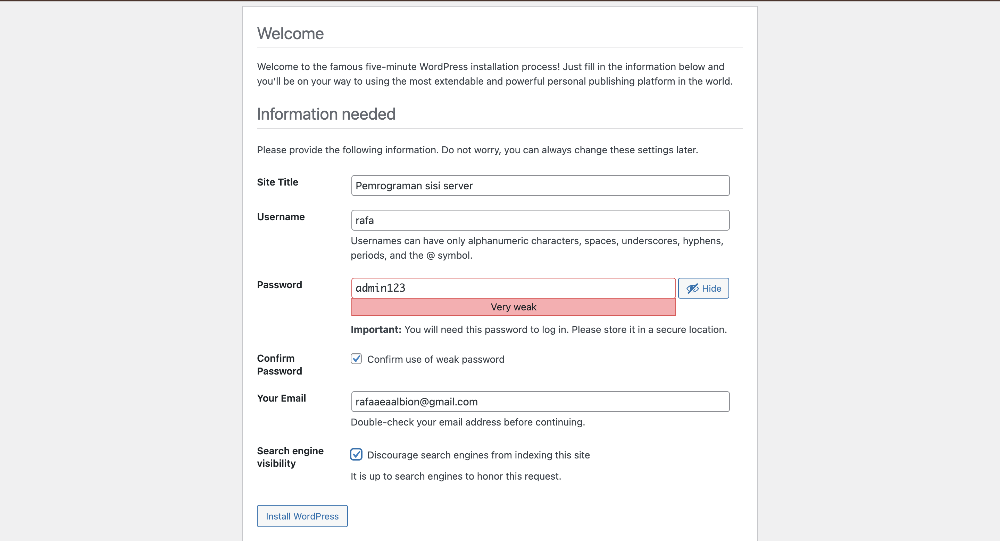
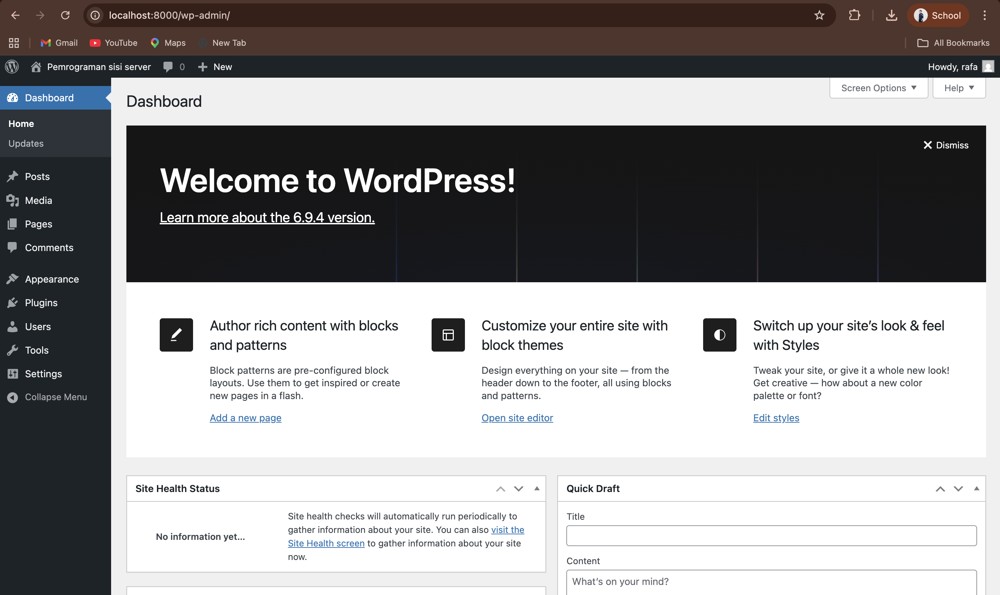
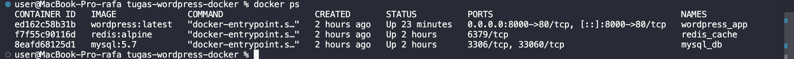
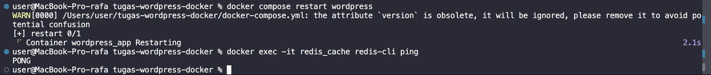
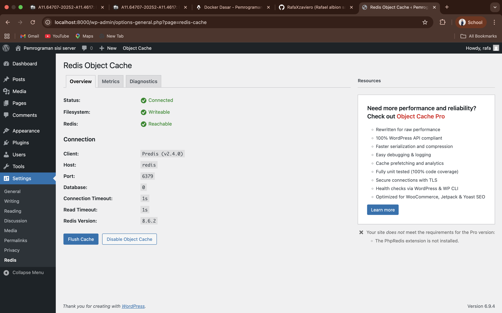

# Laporan Tugas: Multi-Container Orchestration WordPress & Redis

Tugas ini mendemonstrasikan implementasi CMS WordPress menggunakan Docker Compose dengan arsitektur 3-tier yang mencakup Database (MySQL) dan Caching (Redis).

## 🎯 Learning Objectives
* Memahami multi-container setup dengan Docker Compose.
* Konfigurasi service dependencies (`depends_on`).
* Implementasi Docker networking antar container.
* Volume untuk data persistence.
* Environment variables configuration.

---

## 📦 File Konfigurasi (docker-compose.yml)
Proyek ini menggunakan 3 service utama:
1. **WordPress**: Sebagai application server (Port 8000).
2. **MySQL 5.7**: Sebagai database engine.
3. **Redis Alpine**: Sebagai object cache server.

---

## 🛠️ Langkah Pengerjaan & Penggunaan
1. Pastikan Docker Desktop aktif di MacOS.
2. Jalankan perintah `docker compose up -d` di terminal.
3. Akses `http://localhost:8000` untuk instalasi awal WordPress.
4. Instal plugin **Redis Object Cache**.
5. Tambahkan konfigurasi host Redis ke file `wp-config.php` di dalam kontainer.
6. Aktifkan Object Cache melalui Settings WordPress.

---

## 📸 Dokumentasi Praktikum

### 1. WordPress Installation Page
Tampilan awal proses instalasi WordPress sebelum masuk ke dashboard.

### 2. WordPress Dashboard
Halaman dashboard admin setelah instalasi selesai dilakukan.

### 3. Docker Containers Running (docker ps)
Status ketiga kontainer yang berjalan sinkron dalam satu jaringan.

### 4. Redis CLI Ping Test
Uji koneksi manual ke kontainer Redis dengan perintah `docker exec -it redis_cache redis-cli ping`.

*(Hasil: PONG)*

### 5. Redis Object Cache (Bonus)
Status integrasi Redis yang sudah menunjukkan status **Connected** dan **Reachable**.

---

## ❓ Jawaban Pertanyaan

* **Kenapa perlu volume untuk MySQL?**
  Karena kontainer bersifat *ephemeral* atau sementara. Tanpa volume, data database akan terhapus saat kontainer dihentikan. Volume memetakan data ke sistem penyimpanan host agar data tetap aman (persisten).

* **Apa fungsi `depends_on`?**
  Mengatur urutan start-up layanan. Memastikan database dan redis sudah siap sebelum aplikasi WordPress dijalankan untuk menghindari error koneksi saat inisialisasi.

* **Bagaimana cara WordPress container connect ke MySQL?**
  Menggunakan *Service Discovery* di dalam Docker Network. WordPress memanggil nama service `mysql` sebagai hostname, yang kemudian diterjemahkan oleh Docker ke IP internal kontainer tersebut.

* **Apa keuntungan pakai Redis untuk WordPress?**
  Meningkatkan performa dengan menyimpan hasil query database di RAM (caching). Hal ini mengurangi beban kerja MySQL dan mempercepat waktu muat halaman bagi pengguna.

---

## 📤 Submission Info
* **Nama:** [Rafael Albion Savero]
* **NIM:** [A11.2023.15146]
* **Repository:** [https://github.com/RafaXzaviero/Dockerize-WordPress-dengan-MySQL-dan-Redis]